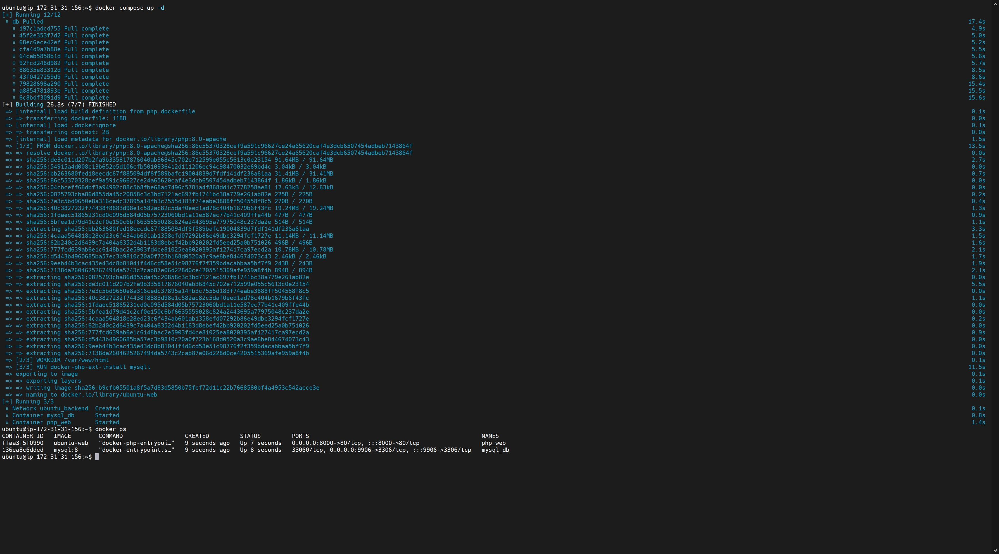
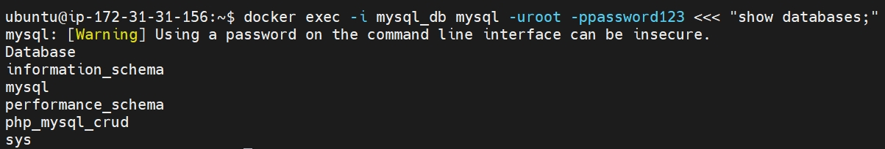
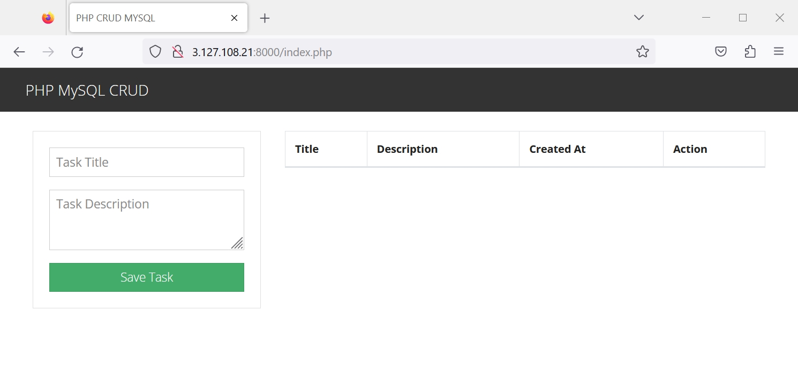
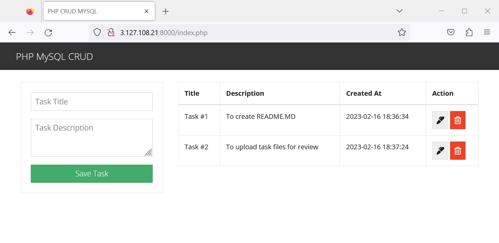

## m5-Docker-Task-01

Написати docker-compose для https://github.com/FaztWeb/php-mysql-crud , котрий:

- піднімає веб-сервер в одному контейнері

- піднімає базу в іншому контейнері

- використовує мережу типу bridge

- порт апача має бути не 80

Буде плюсом:

+ порти в файлі compose параметризовані

+ зміст бази даних має бути збережено при видаленні стека docker-compose

+ використовувати .ENV файл 
для локальних або конфіденційних змінних 
(ім'я користувача, пароль бази тощо).

___

### Solution

[docker-compose.yml](./docker-compose.yml) 
[php.dockerfile](./php.dockerfile)

```yaml
version: '3.8'
services:
  web:
    container_name: php_web
    build:
      context: .
      dockerfile: php.dockerfile
    restart: always
    depends_on:
      - db
    volumes:
      - ./php-mysql-crud/:/var/www/html
    env_file:
      - .env
    # Setting a default port facing the host to 8080 in case .env file does not contain any value
    ports:
      - ${PORT_PHP:-8080}:80
    networks: 
      - backend
    logging:
      driver: "json-file"
      options:
        max-size: "50m"
        max-file: "3"
  db:
    container_name: mysql_db
    image: mysql:8
    restart: always
    # Setting a default pw, in case .env file does not contain any value
    environment:
      MYSQL_ROOT_PASSWORD: ${MYSQL_ROOT_PASSWORD:-c2Kyx9mO98ehSD}
    env_file:
      - .env
    volumes:
      - db-data:/var/lib/mysql
      - ./php-mysql-crud/database/script.sql:/docker-entrypoint-initdb.d/script.sql
    # Setting a default port facing the host to 9306 in case .env file does not contain any value
    ports:
      - ${PORT_MYSQL:-9306}:3306
    networks:
      - backend
    logging:
      driver: "json-file"
      options:
        max-size: "50m"
        max-file: "3"
# Creates a backend bridge network
networks:
  backend:
# Makes database data volume persistent
volumes:
  db-data:
```

```dockerfile
FROM php:8.0-apache
WORKDIR /var/www/html
RUN docker-php-ext-install mysqli
```

At first - clone the repository with the application.

```bash
git clone https://github.com/FaztWeb/php-mysql-crud.git
```

Next - it is important to modify the hostname of the database. It can be acomplished with the below command.

```bash
sudo sed -i 's/localhost/db/g' ./php-mysql-crud/db.php
```

```php
<?php
session_start();

$conn = mysqli_connect(
  'db',
  'root',
  'password123',
  'php_mysql_crud'
) or die(mysqli_erro($mysqli));

?>
```

The following files should be placed next to the application's directory: __docker-compose.yml__, __php.dockerfile__ and __.env__ file with environment variables. To spin up the docker compose in detached mode:

```bash
docker compose up -d
```

<details><summary>Screenshots</summary>









</details>

By editing the .env file - ports and other secret environmental variables can be parameterized. Content of .env file:

```
PORT_PHP=8000
PORT_MYSQL=9906
MYSQL_ROOT_PASSWORD=password123
```